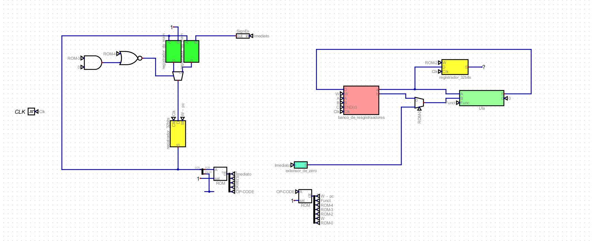
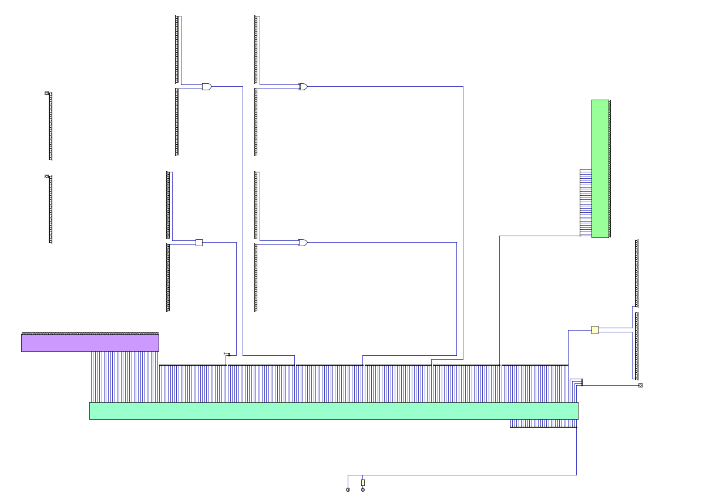

# Processador feito na aula de Projetos Digitais.
## Antonio da Ressurreição Filho, aluno do segundo período de Ciência da Computação da Universidade Federal do Paraná (UFPR).
## Professor da matéria: Doutor Giovanni Venâncio. [site](https://www.inf.ufpr.br/giovanni/) 

### Português:

***Arquivo "TrabPD.pdf":***

Observa-se no arquivo "TrabPD.pdf" o enunciado do trabalho, criado pelo professor da Universidade Federal do Paraná Doutor Giovanni Venâncio. Esse arquivo foi utilizado como auxílio para que o trabalho fosse feito, em que é
possível observar nele a ideia principal contida no trabalho, a qual consiste basicamente na implementação de um processador inspirado na arquitetura MIPS.

***Arquivo "Codigo-C.c":***

Nota-se no arquivo "Codigo-C.c" o código na **linguagem C** feito pelo professor Doutor Giovanni Venâncio, o qual foi traduzido posteriormente para outra linguagem e foi utlizado nas memórias ROM do processador para que se façam
todas as operações, provando assim, que o processador e todos circuitos contidos nele funcionam perfeitamente.

***Arquivo "Relatório de Projetos.pdf":***

No arquivo "Relatório de Projetos.pdf" observa-se um pequeno relatório que fiz em relação às implementações que fiz durante o trabalho, mais detalhadamente sobre a minha Unidade Lógica Aritmética (ULA), a qual serve para fazer
as operações aritméticas, sobre meu Banco de Registradores e sobre meu programa principal. Ademais, nesse arquivo também tem a tradução do código C, criado pelo professor Doutor Giovanni Venâncio, para a linguagem **Assembly**,
para **binário** segundo a tabela dos OpCodes que eu criei em uma das minhas memórias ROM e para **Hexadecimal** segundo a mesma tabela citada anteriormente. 

***Pasta "imagens":***

Nessa pasta contém as imagens dos principais circuitos do meu programa principal do processador inspirado na arquitetura MIPS.

***Arquivo "trabalho_projetos.tgz":***

Esse arquivo, comprimido para .tgz, consiste nos arquivos do meu processador, os quais foram feitos no programa **Digital** e estão todos em formato .dig.

1. ***"Main.dig":*** Consiste no programa principal, onde basicamente todos os outros arquivos são executados simultaneamente e que consegue-se ver o funcionamento correto do processador inspirado na arquitetura MIPS.
   

2.  ***"Ula.dig":*** Consiste na minha Unidade Lógica Aritmética, onde faz-se as operações AND, OR, XOR, multplicação, adição, subtração e deslocamento entre dois números de 32 bits (A e B). Com meu multiplexador conectado a uma entrada
de 4 bits, em que cada número entre esses bits representa uma operação, conforme a seguir (detalhe importante: o bit mais significativo não é usado, somente está para fazer alusão correta à imagem do arquivo "TrabPD.pdf"):

- 0000 = Somador.
- 0001 = Subtrador.
- 0010 = Multiplicador.
- 0011 = And.
- 0100 = Or.
- 0101 = Xor.
- 0110 = Deslocador.

3. ***"banco_de_registradores.dig":*** Consiste no meu banco de registradores, no qual estão presentes 16 registradores de 32 bits cada, uma entrada "enable" W que consiste no botão de ativação do meu desmultiplexador que fica responsável por
escrever em um registrador escolhido. Além disso, há a entrada D, que estará ligada a todos os meus registradores e dirá o que será lido e repassado a saida "a" e a saída "b" através do banco de registradores. Há também, por fim, a entrada "Clk",
que consiste no Clock que é usado no programa principal.

4. ***"registrador_do_main.dig":*** Consiste basicamente no somador do meu PC, que está duplicado no meu programa principal porque terão opções do PC ir logo para a próxima linha (PC+1) ou dele pular e voltar linhas, através das operações de saltos
condicionais e incondicionais. Esses circuitos duplicados estão ligados no programa principal a um multiplexador que escolherá qual desses dois irá fazer a próxima operação, através dos códigos repassados na memória ROM.

5. ***Memórias ROM:*** Essas memórias são um dos circuitos mais importantes de todo o programa principal. Elas, juntas, fazem todo aquele código C que está no arquivo "Codigo-C.c" e depois traduzido para a linguagem de Assembly como mostrado no arquivo
"Relatório de Projetos.pdf" funcionar e organizam quais entradas devem ser ativadas nos multiplexadores do programa principal. Nelas, estão ligados a saída do PC e de 32 bits e o OP-CODE de 4 bits que sai de uma delas. É possível observar mais abaixo
o arquivo "Tabela-Memória ROM dos Mux.png", que consiste basicamente nas instruções dadas a memória ROM que divide o Imediato, o registrador que se escreve, os dois registradores que se leem e o OPCODE, que é baseado na memória ROM que liga os multiplexadores.

7. ***Outros arquivos:*** Os outros arquivos presentes nessa pasta são circuitos integrados que foram feitos com o intuitochegar nos circuitos acima mencionados. Lembrando: para que se veja todo o processador funcionando na plataforma ***"Digital"***, é
importante baixar todos os arquivos dessa pasta.

***Arquivo "Tabela-Memória ROM dos Mux.png":***

Como dito anteriormente, esse arquivo consiste na tabela usada para se fazer a memória ROM que manda as informações para o Imediato, para o registrador onde se escreve, para os 2 registradores onde se leem e para o OPCODE que é usado na outra memória ROM para
ativar e desativar os botões 1 e 0 dos multiplexadores do programa principal.

